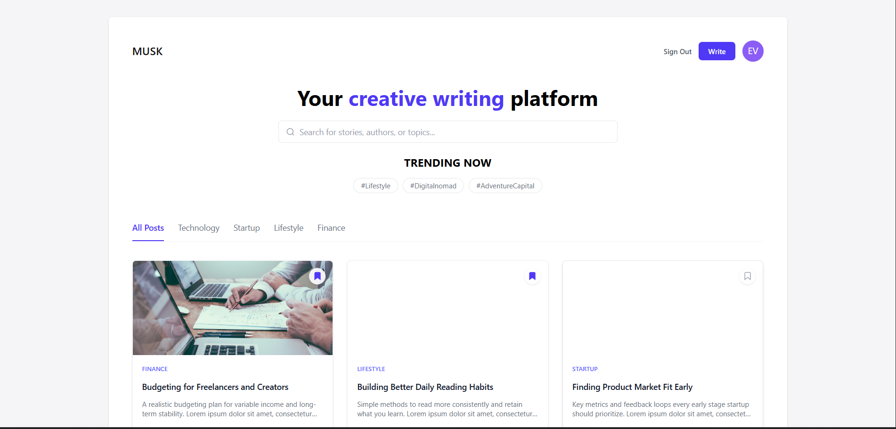
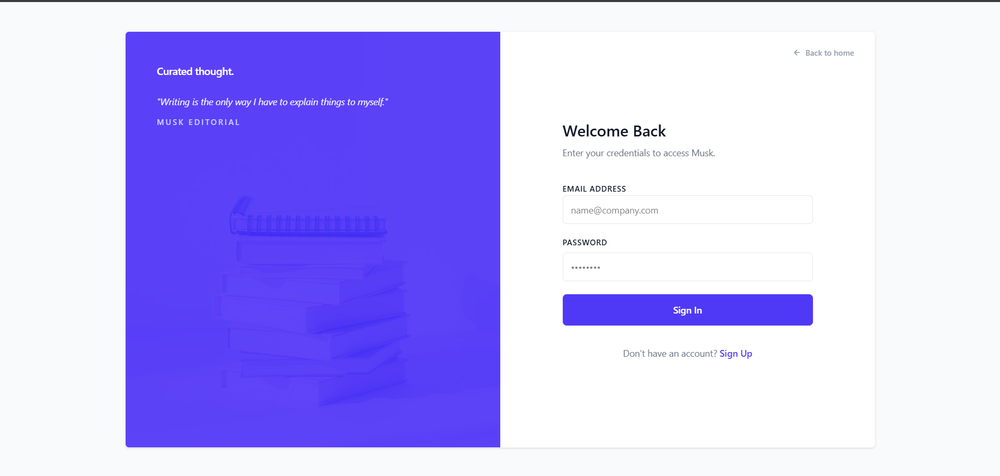
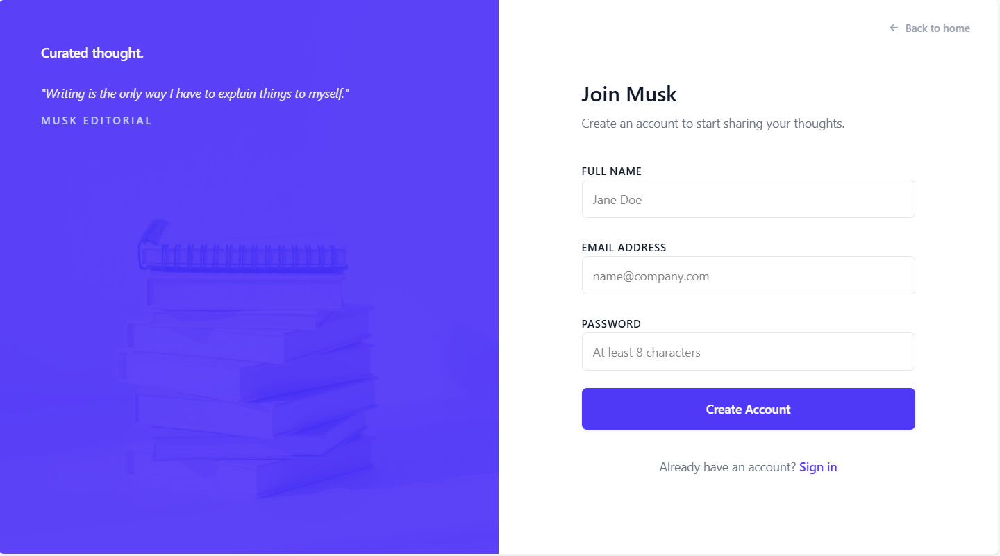
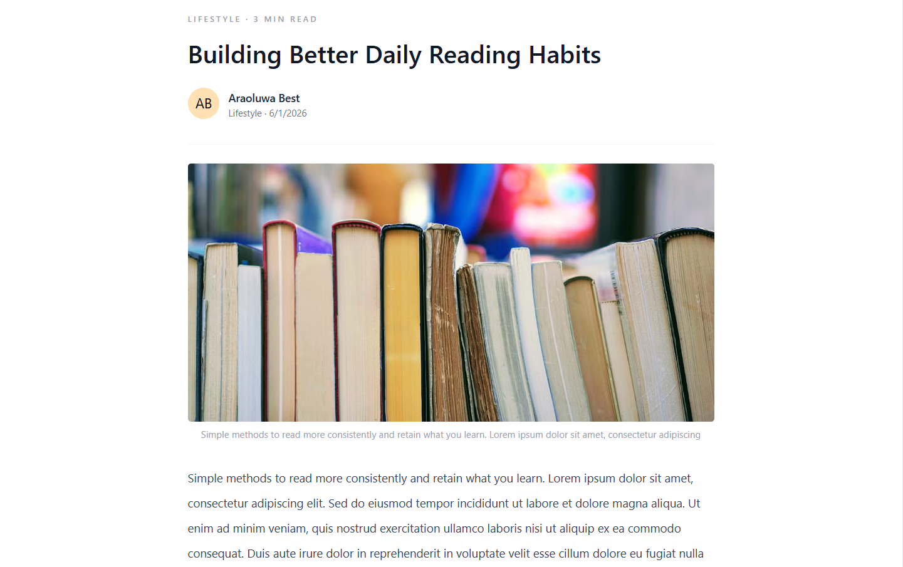

# **Musk Blog Platform**

A full-stack blog platform designed for minimal computing and focused content sharing.

## 📌 Description

Musk is a blog platform where users can create, read, update, and delete posts. The platform emphasizes a distraction-free experience with authenticated user features, interactive posts (likes/comments), and a guided onboarding experience for new users.

It features a robust backend built with Node.js, Express, and Prisma, and a frontend developed using React and TypeScript.

## 🤝 Key Features
- **Secure Authentication:** Sign up, log in, and protected routes.
- **Mandatory Onboarding:** New users are guided to complete their profile (Bio, Location) immediately upon signing up.
- **Post Management:** Create posts with mandatory tags and cover images; edit/delete your own posts.
- **Interactive Content:** Like, save, and comment on posts with threaded replies.
- **Smart Search:** Quickly find stories, authors, or topics directly from the homepage.
- **Responsive Design:** Consistent UI across devices, including a dedicated 404 error page.

## 🗄️ Tech Stack
- **Backend:** Node.js, Express, TypeScript, Prisma (PostgreSQL)
- **Frontend:** React, TypeScript, TailwindCSS, Vite
- **Deployment:** Render (Static Site for Frontend, Web Service for Backend)

## 🛠️ Setup

### Backend
1. Navigate to the `backend` folder:
   ```bash
   cd backend
   ```
2. Install dependencies:
   ```bash
   npm install
   ```
3. Setup `.env` (ensure `DATABASE_URL` is set).
4. Generate Prisma client:
   ```bash
   npx prisma generate
   ```
5. Run the backend:
   ```bash
   npm run dev
   ```

### Frontend
1. Navigate to the `frontend` folder:
   ```bash
   cd frontend
   ```
2. Install dependencies:
   ```bash
   npm install
   ```
3. Run the frontend:
   ```bash
   npm run dev
   ```

## 📸 Screenshots of User Interface

### 🏠 Home Page


### 🔐 Login Page


### ✍️ Sign Up Page


### 📊 Post Page

